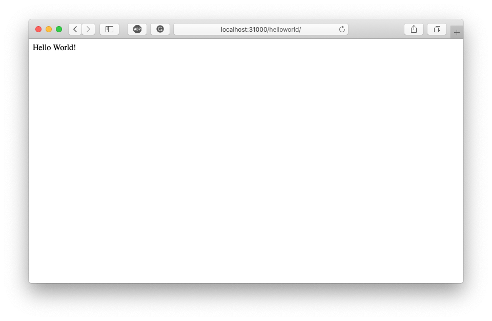
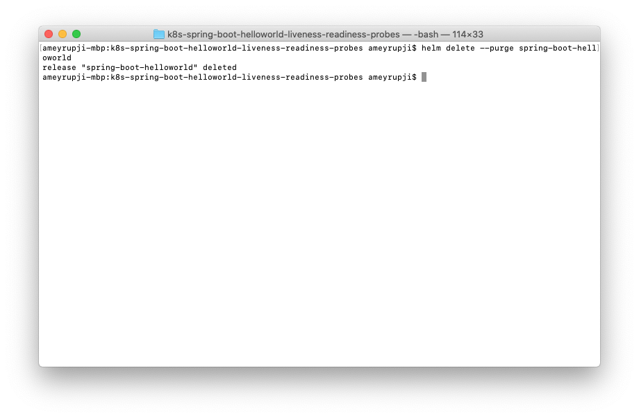

| [◂ Previous](https://github.com/ameyrupji-k8s/k8s-spring-boot-helloworld) |
|-----|

# k8s-spring-boot-helloworld-liveness-readiness-probes

Taking the Kubernetes Spring Boot Hello World Application further. This example adds readiness and liveness probes. Readiness probes helps to know when a Container is ready to start accepting traffic. Liveness probes helps to know when to restart a Container. For example, liveness probes could catch a deadlock, where an application is running, but unable to make progress.

Read more about liveness and readiness probes [here](https://kubernetes.io/docs/tasks/configure-pod-container/configure-liveness-readiness-startup-probes/).


## Prerequisites

- Java IDE (I am using IntelliJ CE)
- Maven
- Docker
- Helm


## System Configuration at time of test

- macOS Mojave - Version 10.14.6
- IntelliJ CE - Version CE 2019.2
- Maven - Version 3.6.1
- Docker Desktop - Version 2.1.0.1 (37199)
- Kubernetes - 
- Helm - Version 

## Initial Setup

### Adding Spring Boot Actuator to the Application

Add this code to this `file`
```
```

More information about Spring Boot Actuator can be found [here](https://docs.spring.io/spring-boot/docs/current/reference/html/production-ready-features.html#production-ready-health).

### Adding Liveness probe

Add this code to this `file`
```
```

### Adding Readiness probe

Add this code to this `file`
```
```


## Test 

Install container using helm command

``

Run the following command to ensure the server is running: `curl http://localhost:31000/helloworld/`

You can also view it in the browser by going to `http://localhost:31000/helloworld/` and following response will show up:




Update App using helm command

``

View the new pod getting created through the dashboard and the old pod getting cycled out.

View the app again in a browser `http://localhost:31000/helloworld/`:


## Cleanup

To stop the container that is running use this command: `helm delete --purge spring-boot-helloworld`




## Useful links

- https://www.baeldung.com/spring-boot-kubernetes-self-healing-apps
- https://www.baeldung.com/kubernetes-helm
- https://medium.com/@pablorsk/kubernetes-helm-node-hello-world-c97d20437abd
- https://docs.spring.io/spring-boot/docs/current/reference/html/production-ready-endpoints.html
- https://kubernetes.io/docs/tasks/configure-pod-container/configure-liveness-readiness-startup-probes/

| [Next ▸](https://github.com/ameyrupji-k8s/k8s-spring-boot-helloworld-security-context) |
|-----|
